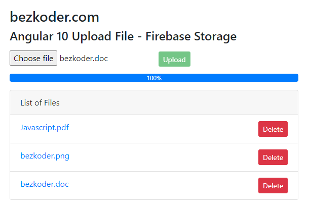

# Firebase Storage + Angular 10: File Upload example 

In this tutorial, I will show you how to make File Upload/Display/Delete with Firebase Storage and Angular 10 with the help of `@angular/fire`. Files' info will be stored in Firebase Realtime Database.

For more detail, please visit:
> [Firebase Storage + Angular 10: File Upload/Display/Delete example](https://bezkoder.com/firebase-storage-angular-10-file-upload/)

More Practice:
> [Angular 10 Firebase CRUD Realtime DB | AngularFireDatabase](https://bezkoder.com/angular-10-firebase-crud/)

> [Angular 10 Firestore CRUD | AngularFireStore](https://bezkoder.com/angular-10-firestore-crud-angularfire/)

> [Angular 10 CRUD application example with Web API](https://bezkoder.com/angular-10-crud-app/)

Fullstack with Node.js Express:
> [Angular 10 + Node.js Express + MySQL](https://bezkoder.com/angular-10-node-js-express-mysql/)

> [Angular 10 + Node.js Express + PostgreSQL](https://bezkoder.com/angular-10-node-express-postgresql/)

> [Angular 10 + Node.js Express + MongoDB](https://bezkoder.com/angular-10-mongodb-node-express/)

Fullstack with Spring Boot:
> [Angular 10 + Spring Boot + MySQL](https://bezkoder.com/angular-10-spring-boot-crud/)

> [Angular 10 + Spring Boot + PostgreSQL](https://bezkoder.com/angular-10-spring-boot-postgresql/)

> [Angular 10 + Spring Boot + MongoDB](https://bezkoder.com/angular-10-spring-boot-mongodb/)

Fullstack with Django:

> [Angular 10 + Django Rest Framework](https://bezkoder.com/django-angular-10-crud-rest-framework/)

## Development server

Run `ng serve` for a dev server. Navigate to `http://localhost:4200/`. The app will automatically reload if you change any of the source files.

## Code scaffolding

Run `ng generate component component-name` to generate a new component. You can also use `ng generate directive|pipe|service|class|guard|interface|enum|module`.

## Build

Run `ng build` to build the project. The build artifacts will be stored in the `dist/` directory. Use the `--prod` flag for a production build.

## Running unit tests

Run `ng test` to execute the unit tests via [Karma](https://karma-runner.github.io).

## Running end-to-end tests

Run `ng e2e` to execute the end-to-end tests via [Protractor](http://www.protractortest.org/).

## Further help

To get more help on the Angular CLI use `ng help` or go check out the [Angular CLI README](https://github.com/angular/angular-cli/blob/master/README.md).
